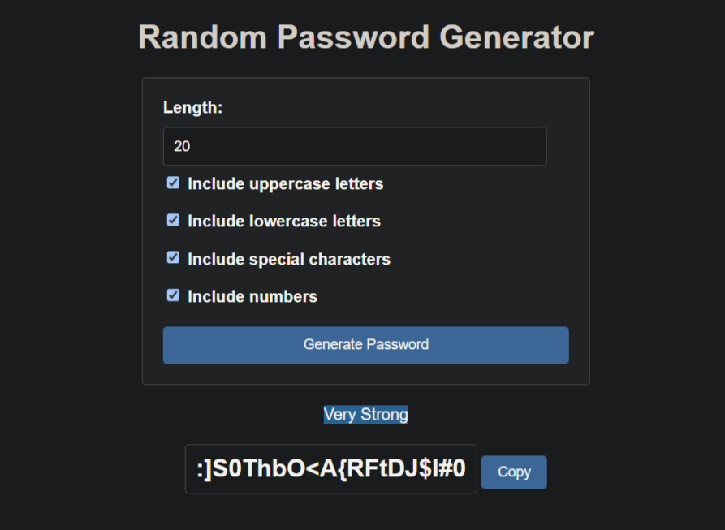

# Flask Random Password Generator

This project is a simple Flask application that generates a random password based on user input. The user can specify
the length of the password and whether to include uppercase letters, lowercase letters, numbers, and special characters.
Additionally, the generated password difficulty is displayed below the password.



**Features:**

- **Customizable Length:**   Decide your ideal password length (recommended minimum of 12 characters).
- **Character Options:**   Select from uppercase, lowercase, numbers, and special characters for enhanced complexity.
- **Difficulty Meter:**    Get a quick visual gauge of generated password strength.

**How to Use:**

1. **Clone the Repository:**  Use Git to clone this repository to your local machine.
2. **Set Up Virtual Environment:**  Activate a virtual environment to isolate project dependencies. Here's a guide for
   creating a virtual environment:
    - **Windows:**
      ```bash
      python -m venv venv
      venv\Scripts\activate
      ```
    - **Linux:**
      ```bash
      python3 -m venv venv
      source venv/bin/activate
      ```
3. **Install Dependencies:**  Install the required Python libraries using `pip`:
   ```bash
   pip install -r requirements.txt
   ```
4. **Run the App:**  Start the development server with:
   ```bash
   python app.py
   ```

Now, you can visit `http://127.0.0.1:5000/` (or your local development server address) in your web browser to access the
password generator.
